# Content Management System

This is a full stack web application that helps users create, manage, and modify content on a website without the need for specialized technical knowledge. It has following features:

- User roles (Admin, subscriber)
- Post blogs, comments on web application
- Personalized dashboard for admin and subscriber
- Statistics information display of useful data for admin
- Admin can add, remove, edit the posts, users, comments, posts categories from admin dashboard.
- User authentication.

## Instructions to run on localhost

### Prerequisites

- xampp
- git

### Setting up project

- Go to directory where **`xampp`** is installed.
- Go to **`htdocs`** directory
- Git clone the project using following command.

  ```bash
  git clone git@github.com:naveen-ku/cms.git
  ```

- Open the **`cms`** or **`localhost/Content-Management-System`** in any project editor to start working.

### Setting up database

- Start xampp server
- Create database in MySQL or import the **`cms.sql`** file in database for premade database.

### Connecting database

- Create file with name **`db_cred.php`** in root folder of repository.
- Write code as follows in **`db_cred.php`**:

```php
<?php
    $db['db_host'] = "your_host_name";    // localhost
    $db['db_user'] = "your_user_name";    // root
    $db['db_name'] = "your_db_name";      // eg: cms
    $db['db_pass'] = "your_db_pass";      // eg: naveen@123
>?
```

### Start the project on browser

- Start xampp control panel and start **`Apache`** and **`Mysql`** server.
- Go to browser and enter url **`localhost/cms`** or **`localhost/Content-Management-System`**

## Snapshots

<p align="center">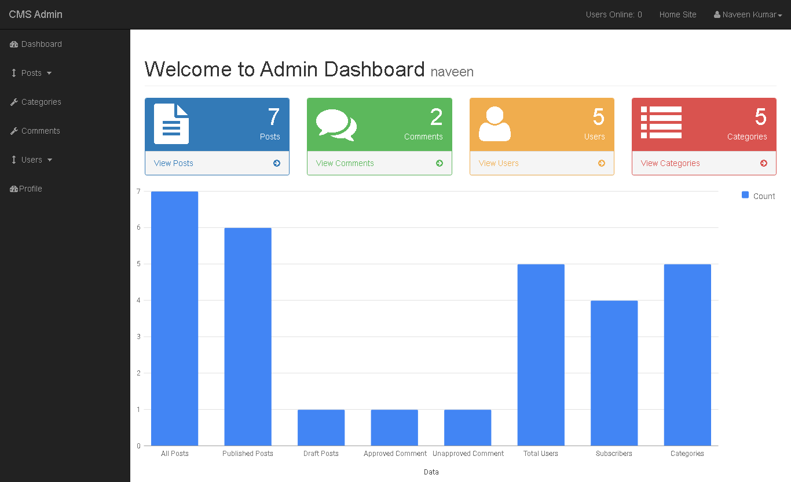</p>
<p align="center">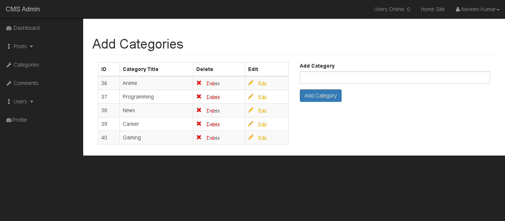</p>

<p align="center">
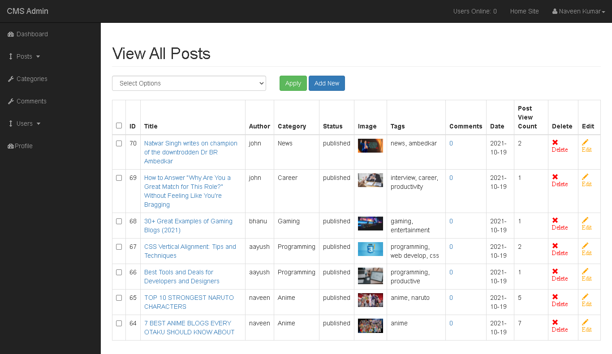
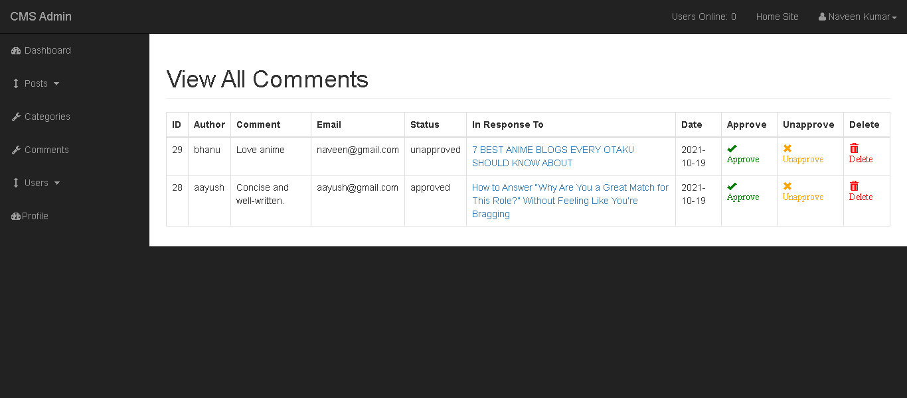
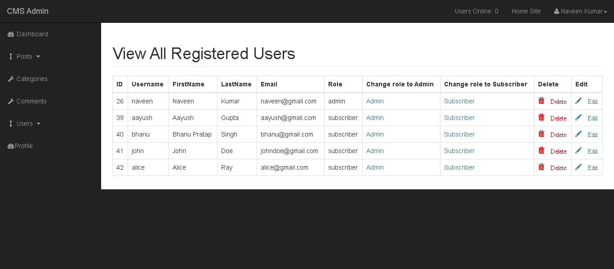
</p>

<p align="center">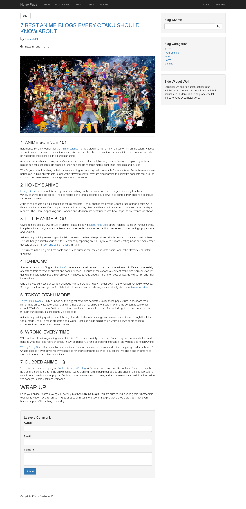</p>
<p align="center">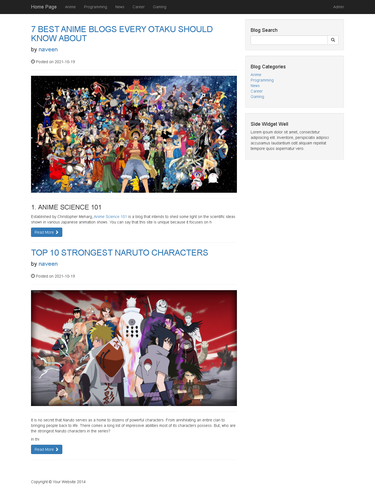</p>
<p align="center">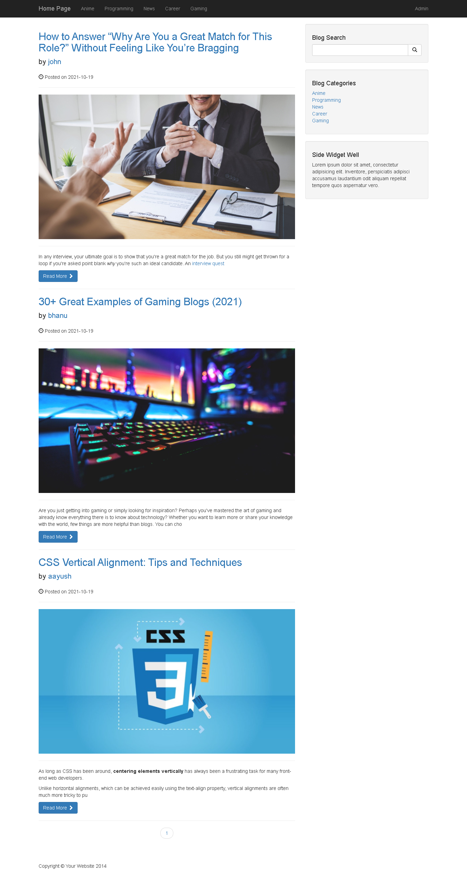</p>

<p align="center">
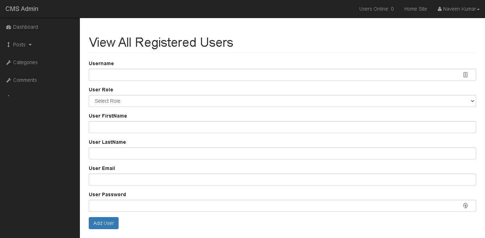
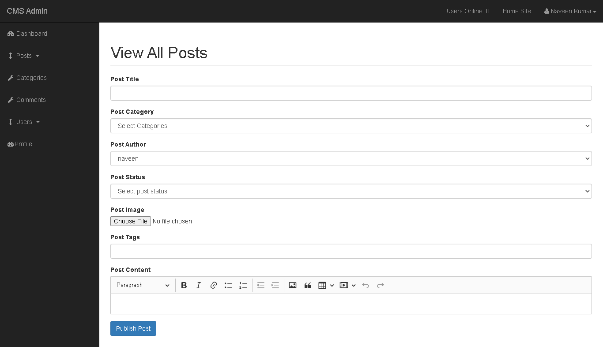
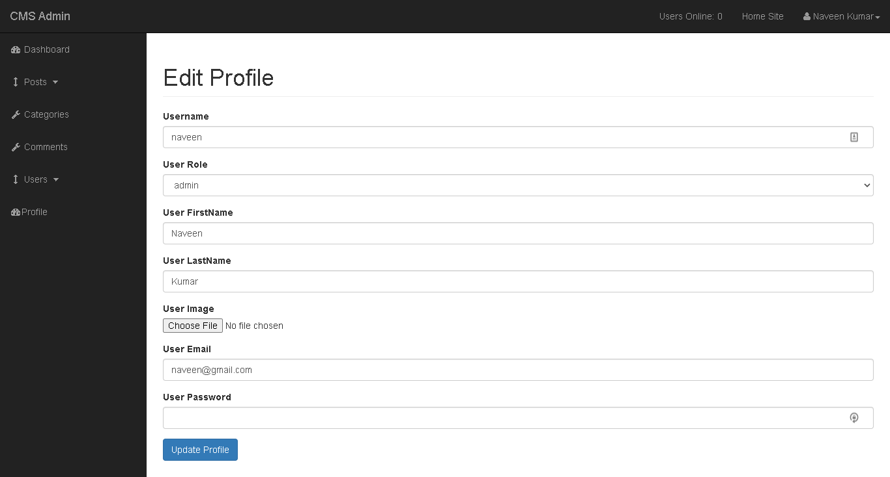

</p>
<p align="center">
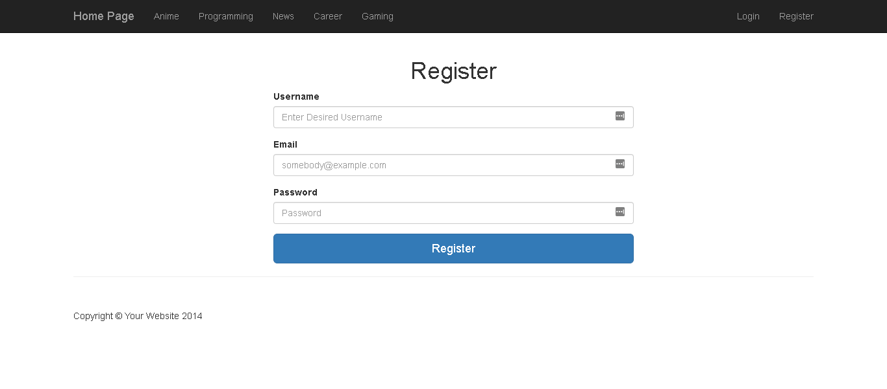
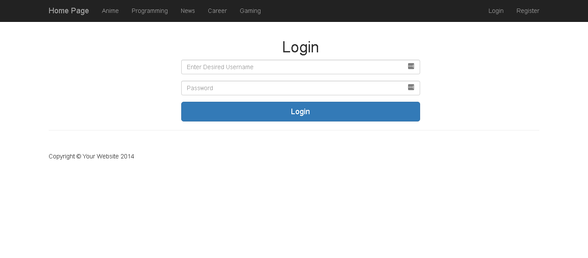
</p>
